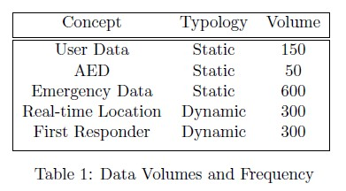

# Performance Requirements

Performance requirements define how well the software system accomplishes certain functions under specific conditions. 
To assess the performance of the system, we analyzed the following characteristics: response time, workload and scalability.

## Response Time

The response time refers to the time employed to execute and complete specific tasks. Considering the environment in which HeartBeat operates, speed of execution is a crucial aspect:
The goal of the software is to minimize the time of intervention in case of cardiac arrest, so, it is essential for the micro-services to communicate rapidly with each others and with the user app.

## Workload

To assess the workload, we built a table of volumes to estimate data volumes and usage frequency of the databases of the system. 
In the table showed below, we estimated the volume of data flowing to the database systems, in the region of Emilia Romagna, every month.

As we can see, around 150 new users download the application and enroll themselves to the register of first responders.

Then, we estimated around 50 new AED added each month to the regional register of defibrillators, which would imply updating both the ECC official list and the HeartBeat database.

Emergency data refers to the data that are shared by the Emergency Communications Center every time a ’code blue’ is recorded. Keeping in mind that around 150.000 people are victim of sudden heart attack every year, we estimated around 600 emergencies in the area of Emilia Romagna every month.

Finally, first responder refers to the recording of the data of users who accepted the emergency alert, while real-time location concerns the recording of their coordinates. 
The frequency of these two entities is the same and we estimated that given 600 sudden cardiac arrest, HeartBeat would
successfully identify suitable first responders and AED 50% of the times.

## Scalability

Scalability refers to the ability of the software to handle increased workloads with minimal cost impact. In this case, keeping in mind that Heart- Beat operates on a regional level, data should flow at a constant rate.

Of course, in case of expansion, the system would have to deal with increased workload and scalability issues. 
However, for what concerns performance requirements, the most important one regards the speed of execution.