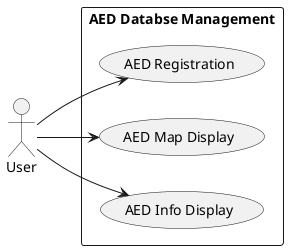

```plantuml
@startuml
left to right direction
actor "User" as fr
rectangle "AED Databse Management" {
  usecase "AED Registration" as UC1
  usecase "AED Map Display" as UC2
  usecase "AED Info Display" as UC3
}
fr --> UC1
fr --> UC2
fr --> UC3
@enduml
```