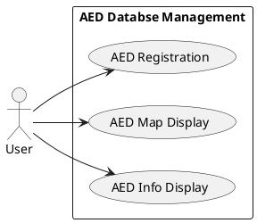

# AED Database Management

## Use Case Diagram

## Analysis of Use Cases

In this section we will analyze more in details each use case identified in the AED Database Management.

**AED Registration:**

> 1. User fills the AED registration form with the following data:
    * Name of the place
    * Address
    * Additional (_optional_) info about the exact location
    * Availability (month - days - hours)
    * Picture (_optional_)
> 2. User submits the registration form.
> 3. System confirms registration.
> 4. System sends the data about the new AED to the Emergency Communications Center, which updates the database.

> **Extensions:**

> * Invalid registration due to invalid data.

**AED map display:**

> 1. System detects the user's location.
> 2. System displays AEDs located in the area of 1 km around the location (1 km as default, users can zoom in/out the map to limit/extend the research).

> **Extensions:**

> * User's geo-location is not available.
>   - System displays AEDs in the municipality selected at time of registration.

**AED info display:**

> 1. User selects a specific AED.
> 2. System shows the AED profile.