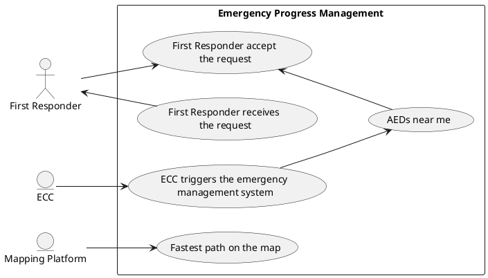

```plantuml
@startuml
left to right direction
actor "First Responder" as fr
entity "ECC" as ecc
entity "Mapping Platform" as maps
rectangle "Emergency Progress Management" {
  usecase "ECC triggers the emergency \nmanagement system" as UC1
  usecase "First Responder accept \nthe request" as UC4
  usecase "First Responder receives \nthe request" as UC2
  usecase "AEDs near me" as UC3
  usecase "Fastest path on the map" as UC5
}
fr --> UC4
fr <-- UC2
ecc --> UC1
UC1 --> UC3
UC4 <-- UC3
maps --> UC5
@enduml
```