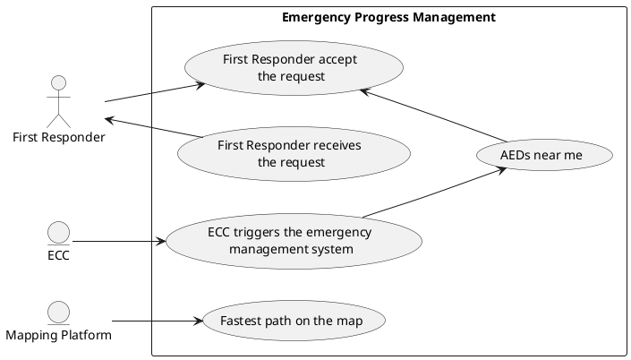

# Emergency Progress Management

## Use Case Diagram

## Analysis of Use Cases

In this section we will analyze more in details each use case identified in the emergency progress management.

**The Emergency Communications Center triggers the emergency process in the system:**

1. The Emergency Communications System sends data about the emergency:
    * Time of alert
    * Reference point
    * Address
    * Ambulance Estimated Time of Arrival
2. The system identifies suitable First Responders:
    * Through active location 
    * According to the municipality selected
3. The system sends the alert notification to the selected First Responders.

**First Responder receives the help request:**

1. User opens the notification, which opens the application and automatically turn the location on.
2.  User accepts/declines the request.

**First Responder accept the request:**

1. System sends confirmation to the Emergency Communications System (which will see the responder's movements in real time).
2. System displays emergency details.

**AEDs near me:**

1. System checks for _AVAILABLE AEDs_ in the area.
2. System displays AEDs on the map.

**Fastest path on the map:**

1. User clicks the 'guide me' command.
2. The system opens the mapping platform.
3. The system inserts the emergency location in the map.