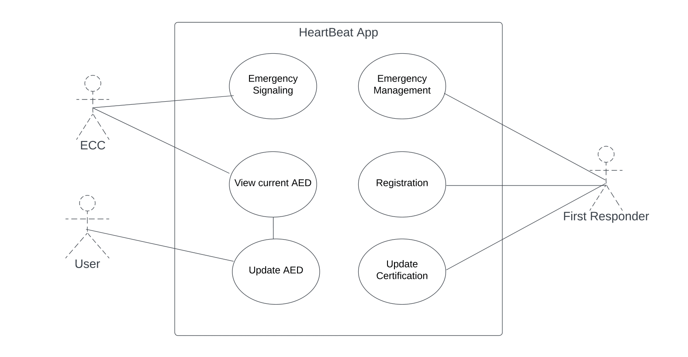

# HeartBeat System Use Cases

In this section we will analyze more in details each use case identified in the HeartBeat system.

1. **Emergency Signalling**

    - Primary actor: Emergency Communications Center
    - Scope: Send the emergency notification to First Responders
    - Scenario: somebody calls the 118 for a medical emergency regarding a cardiac arrest

 It all starts when the '118' emergency number is called for a victim of cardio-respiratory arrest.
 As soon as the operator has verified that the emergency regards a cardio-respiratory arrest, he/she assigns the *code blue* to it.

 The assignment of the *code blue* to an emergency triggers the **emergency management system**, which receives the data about the emergency and starts searching for suitable First Responders.

 First responders are selected according to two variables:

 - If the geo-location on the mobile phone is active, First Responder located within 1 km from the emergency site, will be notified.
 - If the geo-location on the mobile phone if switched off, First Responders will be notified according to the municipality selected during the registration.

 This use case terminates when suitable First Responders receive the **emergency alert**.

 2. **View Current AED**

    - Primary actor: Emergency Communications Center & User / First Responder
    - Scope: Visualize AEDs on the map and display information
    - Scenario: Users want to see AEDs located near them in a specific moment

When a user wants to see AEDs displayed on the map, the system will detect the device location,and will display AEDs located in the area of 1 km from the user.

The distance of 1km is set as default but users can zoom in/out the map to limit/extend the research.
In the case in which the users' location is not available, the system will display AEDs according to the municipality selected at the time registration.

Each AED stored in the database has a profile containing all the relevant information, including the address, the reference point and available hours.
Once the user selects a specific defibrillator, the system will display these data.

3. **Update AED**

    - Primary actor: Emergency Communication Center & User / First Responder
    - Scope: New AED is inserted in the system
    - Scenario: A new AED is inserted in the system by the Emergency Communication System or a user

When a user or the Emergency Communication System wants to register a new AED, he/she will need to fill out the registration form with the following data:

- Name of the place (reference point)
- Address
- Location (coordinates)
- Additional information about the location [optional]
- Availability (month - days - hours)
- Picture [optional]

Then, once the form has been submitted, the system confirms the registration of the new AED and updates the ECC database with the new information.

*Extension*: Registration may fail due to invalid or missing data. If this happens, the user will have to re-enter the data and wait for confirmation.

4. **Emergency Management**

    - Primary actor: First Responder 
    - Scope: Accept / Decline the emergency alert
    - Scenario: A First Responders receives an emergency alert and either accepts or declines it

When a first responder receives a help request, he/she clicks on the notification, which will automatically open the application and turn the geo-location on.

The First Responder can accept, decline or ignore the alert.
Once the First Responders has accepted the request, the system will send a confirmation to the Emergency Communications Center, which will see the responder's movements in real-time.

At the same time, the system will display the emergency details to the first responders who accepted the request, which are respectively:

- Time of alert
- Reference point
- Address
- Ambulance ETA

5. **Registration**

    - Primary actor: First Responders
    - Scope: new users join the application
    - Scenario: a user that has obtained a BLSD certificate wants to subscribe to the application creating their profile

After having downloaded the application, users will fill a registration form with the following data:

- Name and Surname
- Email [to be confirmed]
- Telephone
- Municipality (if the geo-localization is not active, the emergency alert will be sent according to the municipality selected) 
- BLSD certificate (emission body)
    - Date of emission
    - Period of validity
- Tax code
- Picture [optional]

At the time of registration, users will also have to authorize the access to location (when using the app), as well as confirm the terms and conditions of the application.

Once users have submitted the form, they will wait for confirmation to be sent by the system.

*Extension*: Registration may fail due to invalid or missing data. If this happens, the user will have to re-enter the data and wait for confirmation.

6. **Update Certificate**

    - Primary Actor: First Responder
    - Scope: update an expired certificate in order to be able to intervene in case of emergency
    - Scenario: the BLSD certificate will expire within a one-month period

The system will automatically calculate the date of expiry and, one month before, it will notify the user to update the certificate.

Users can update their certificate at any time by updating their profile.

*Extension*: Updating may fail due to invalid or missing data. If this happens, the user will have to re-enter the data and wait for confirmation.

