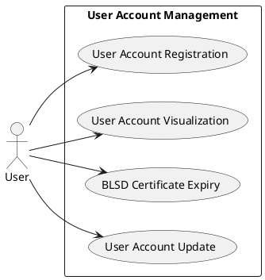

# User Account Management

## Use Case Diagram

## Analysis of Use Cases

In this section we will analyze more in details each use case identified in the User Account Management.

**User registration:**

> 1. User fills a registration form with the following data:
    * Name
    * Surname
    * Email (to be confirmed)
    * Telephone
    * Province
    * Municipality (if the geo-localization is not active, the emergency alert will be sent according to the municipality selected)
    * BLSD certificate (emission body)
    * Date of emission
    * Period of validity
    * Tax Code
    * Picture (_optional_)
    * Authorization to access the location (when using the app)
> 2. User submits the form and waits for confirmation sent on the mobile phone.
> 3. System confirms the registration.
> 4. System sends a confirmation email to user. 

> **Extensions:**

> * Registration fails due to:
    - Invalid mobile phone number
    - Invalid email
    - Missing value
    - Invalid Tax Code

> * Solution:
    - User re-enters the data

**User account visualization:**

> 1. User logins.
> 2. System shows accounts info.
> 3. User logouts.

**BLSD certificate expiry:**

> 1. The expiration date of the certificate is 10 days after the day of today.
> 2. System alerts user with a notification.

**User account update:**

> 1. User logins.
> 2. User updates account info.
> 3. System registers the data modification.
> 4. System sends a confirmation email. 

