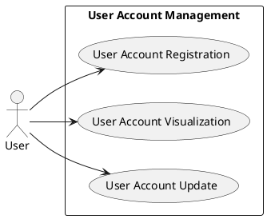

```plantuml
@startuml
left to right direction
actor "User" as fr
rectangle "User Account Management" {
  usecase "User Account Registration" as UC1
  usecase "User Account Visualization" as UC2
  usecase "BLSD Certificate Expiry" as UC3
usecase "User Account Update" as UC3
}
fr --> UC1
fr --> UC2
fr --> UC3
@enduml
```

